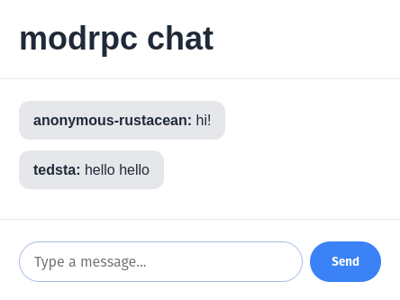
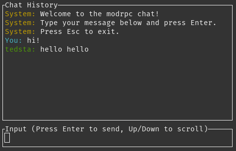

# chat-modrpc-example

This is a sample [modrpc](https://github.com/modrpc-org/modrpc) application showcasing RPC-over-multicast via the `modrpc-hub` transport. There is a terminal client connecting via modrpc-over-TCP and a [Dioxus](https://github.com/DioxusLabs/dioxus) client connecting via modrpc-over-WebSockets. All clients see each other's `send_message` requests and responses without the server application's code going out of its way to make that happen.

The modrpc interface is defined in [chat.modrpc](./chat.modrpc).

The Rust glue for the modrpc interface is generated by [generate.sh](./generate.sh) and is checked in at [chat-modrpc/rust](./chat-modrpc/rust).

## Running

Start the server:
```
cd server
RUST_LOG=info cargo run --release
```

Start the terminal client:
```
cd term-ui
cargo run --release
```

Start the web client:
```
cd ui
dx serve
```

## Screenshots

[Web client](./ui/src/main.rs)



[Terminal client](./term-ui/src/main.rs)



## License

Apache 2.0
